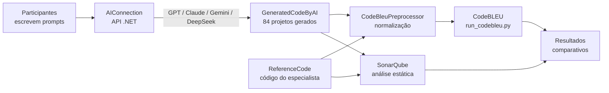

# LLM-CodeQuality-CSharp

Repositório consolidado do Trabalho de Conclusão de Curso (TCC) que avalia a **qualidade do código C# gerado por LLMs**, comparando as saídas de quatro modelos (**GPT**, **Claude**, **Gemini** e **DeepSeek**) entre si e contra uma solução de referência escrita manualmente por um especialista, usando **CodeBLEU** (similaridade estrutural/sintática) e **SonarQube** (qualidade estática e code smells).

Este repositório reúne, em um único lugar, as quatro etapas do pipeline experimental, antes distribuídas em repositórios separados. Cada pasta mantém seu próprio README com os detalhes técnicos completos daquela etapa; este README raiz descreve como elas se encaixam.

## Pipeline

1. **[AIConnection](./AIConnection)** — API ASP.NET Core que envia os 21 prompts (7 participantes × 3 questões) aos quatro LLMs e extrai automaticamente cada resposta como um arquivo `.cs` compilável.
2. **[GeneratedCodeByAI](./GeneratedCodeByAI)** — dataset com os 84 projetos gerados (4 modelos × 3 questões × 7 participantes), a configuração e os resultados completos da análise estática via **SonarQube** (comparando IA vs. especialista).
3. **[ReferenceCode](./ReferenceCode)** — código de referência do especialista (sem uso de IA) para as três questões, usado como baseline em ambas as análises (CodeBLEU e SonarQube).
4. **[CodeBleuPreprocessor](./CodeBleuPreprocessor)** — normaliza o código (gerado e de referência) e calcula as métricas de **CodeBLEU** (AST Match, Dataflow Match, N-gram Match, Weighted N-gram Match) entre cada solução gerada e a solução de referência correspondente.

## Questões avaliadas

- **ArrayDifference** — obtenção dos elementos exclusivos entre dois arrays
- **SequenceComparison** — comparação de sequências
- **StringArrayEncoding** — codificação de arrays de strings (matriz de strings)

## Participantes

7 participantes com prompts de senioridade variada: 5 sêniores, 1 pleno e 1 júnior. ver os prompts completos em [AIConnection](./AIConnection#prompts-utilizados).

## Onde encontrar cada resultado

| O que você procura | Onde está |
|---|---|
| Prompts utilizados por participante/questão | [`DatasetPrompts`](./AIConnection/dataset/prompts.postman_collection.json) |
| Quantidade de execuções por modelo/questão/participante | [`AIConnection/README.md`](./AIConnection#quantidade-de-execuções-por-modelo-questão-e-participante) |
| Código gerado por cada LLM | [`GeneratedCodeByAI/`](./GeneratedCodeByAI) |
| Configuração do SonarQube | [`GeneratedCodeByAI/README.md`](./GeneratedCodeByAI#1-instala%C3%A7%C3%A3o-do-sonarqube-community-via-docker) |
| Resultados do SonarQube (IA vs. especialista) | [`GeneratedCodeByAI/README.md`](./GeneratedCodeByAI#resultados-do-sonarqube) |
| Código de referência do especialista | [`ReferenceCode/`](./ReferenceCode) |
| Datasets normalizados | [`CodeBleuPreprocessor/README.md`](./CodeBleuPreprocessor#datasets-normalizados) |
| Resultados do CodeBLEU | [`CodeBleuPreprocessor/README.md`](./CodeBleuPreprocessor#Resultados-do-codebleu) |

## Stack técnica

- **.NET 10** / ASP.NET Core — APIs de conexão com os LLMs e de pré-processamento de código
- **Microsoft.CodeAnalysis (Roslyn)** — parsing, extração e normalização do código C#
- **Python** + [`codebleu`](https://pypi.org/project/codebleu/) — cálculo das métricas CodeBLEU
- **SonarQube Community Edition** (Docker) — análise estática de qualidade
- **Postman** — extração dos resultados do SonarQube via API REST

## Contexto acadêmico

Este repositório é a infraestrutura experimental completa de uma monografia (TCC) da Universidade Estadual do Ceará (UECE), que avalia comparativamente a qualidade do código C# produzido por diferentes LLMs frente a uma solução de referência humana, sob duas dimensões: similaridade estrutural (CodeBLEU) e qualidade estática (SonarQube).
